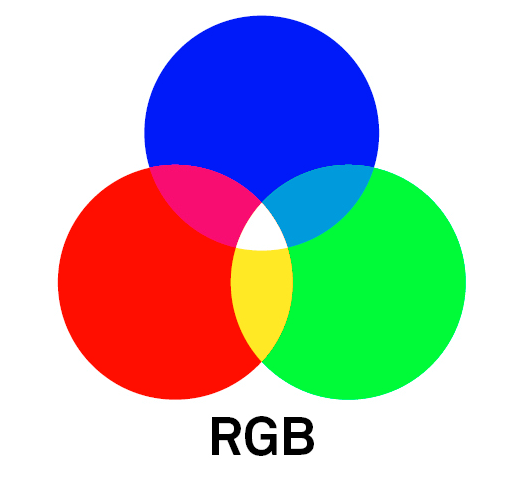
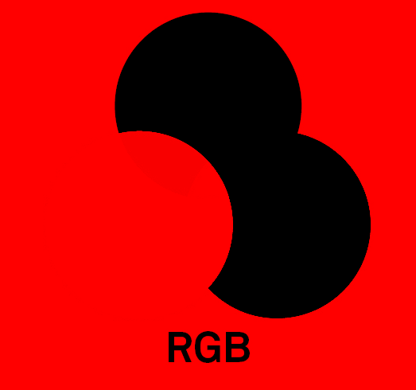
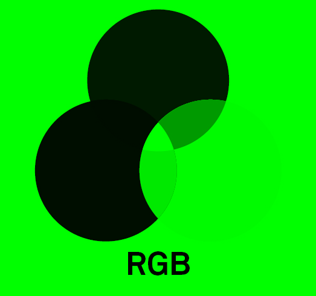
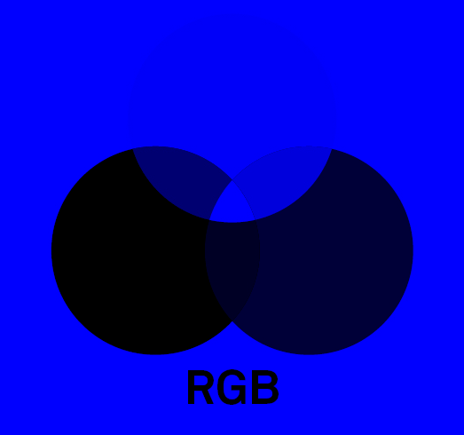
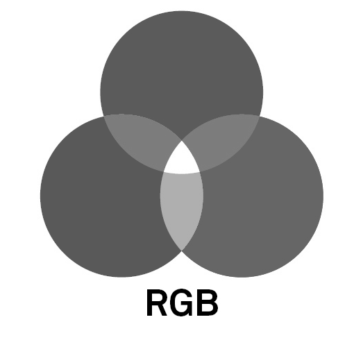
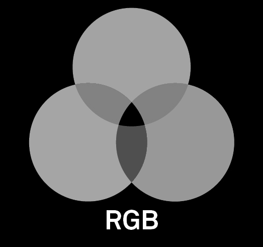
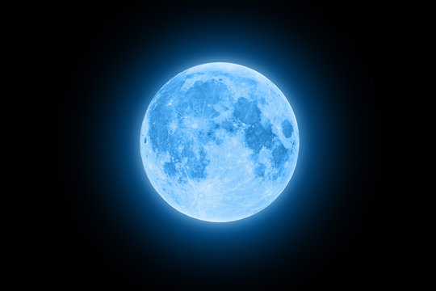
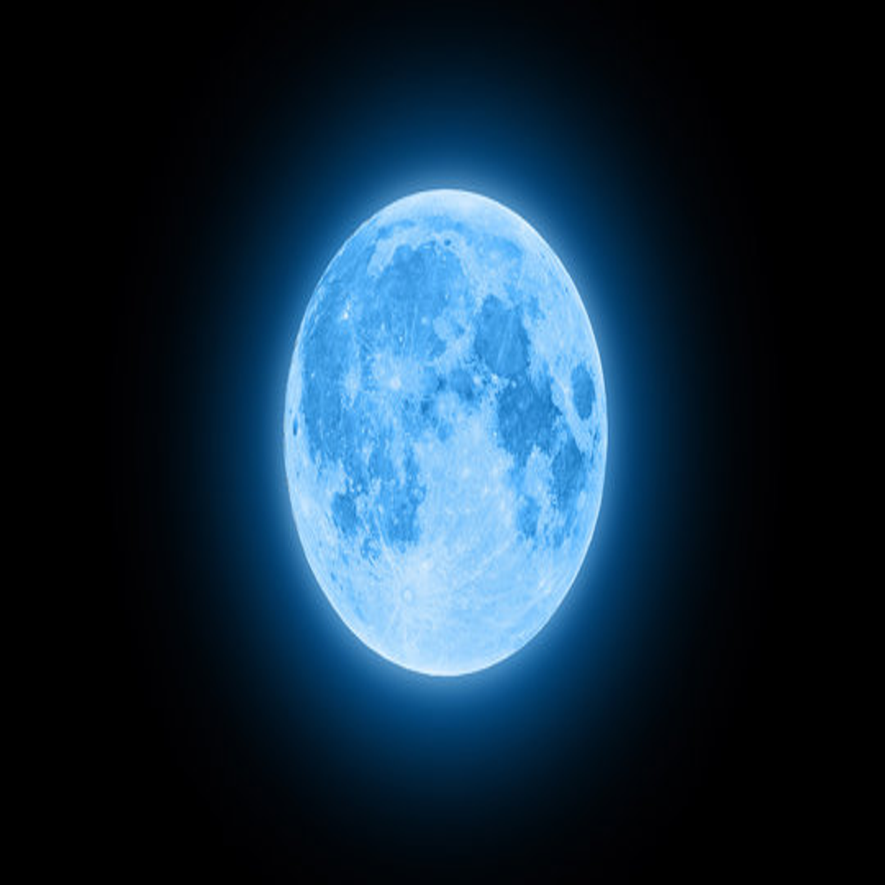

# Лабораторная работа №1
## Цветовые модели и передискретизация изображений 
Каждый студент выполняет все задания. Библиотечные функции передискретизации _не использовать_. 

В качестве исходных изображений использовать полноцветные трёхканальные изображения в форматах bmp или png (не jpeg). 

По итогам выполнении лабораторной работы

Демонстрируется результат каждой операции (до и после).

**1. Цветовые модели** 
* Выделить компоненты R, G, B и сохранить как отдельные изображения.
* Привести изображение к цветовой модели HSI, сохранить яркостную компоненту как отдельное изображение.
* Инвертировать яркостную компоненту в исходном изображении, сохранить производное изображение. 
#### Исходное изображение:

#### Выделенная R компонента:

#### Выделенная G компонента:

#### Выделенная B компонента:

#### Приведённое изображение к цветовой модели HSI, яркостная компонента.

#### Инвертировать яркостную компоненту в исходном изображении, сохранить производное изображение. 

## 2. Передискретизация 
#### Исходное изображение:

#### Растяжение (интерполяция) изображения в M=2 раза по оси Х;

#### Сжатие (децимация) изображения в N=2 раза по оси Х;

#### Передискретизация изображения в K=M/N раз путём растяжения и последующего сжатия (в два прохода);

#### Передискретизация изображения в K раз за один проход.
