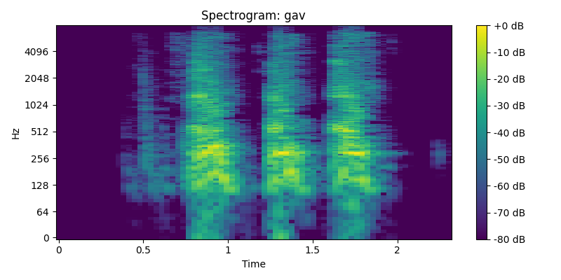

# Лабораторная работа №10 
## Обработка голоса 
**ФИО:** *Гречко Илья Витальевич*  
**Группа:** *Б22-534*  

---

### Cпектрограммы

#### Звук A

#### Звук И

#### Звук лая

### Минимальная и максимальная частота голоса

#### Звук И
Мин: 93.8 Hz, Макс: 3359.4 Hz
Медиана: 97.2 Hz
Овертоны: 194.4, 680.5

#### Звук A
Мин: 93.8 Hz, Макс: 3875.0 Hz
Медиана: 169.7 Hz
Овертоны: 

#### Звук лая
Мин: 101.6 Hz, Макс: 1296.9 Hz
Медиана: 151.0 Hz
Овертоны: 302.0

---

### Наиболее тембрально окрашенный основной тон

#### Звук A

#### Звук И

#### Звук лая

#### Звук A

#### Звук И

#### Звук лая

### Сравнение с табличными значениями:

#### Звук A

|   | табличное значение  | полученное  |
|---|---|---|
|  Первая форманта, Гц | 660  | 645.9  |     
| Вторая форманта, Гц  | 1700  |  1081.2 |     
|  Третья форманта, Гц | 2400  | 2135.0  |    

#### Звук И

|   | табличное значение  | полученное  |
|---|---|---|
|  Первая форманта, Гц | 270  | 287.1  |     
| Вторая форманта, Гц  | 2300  |  2653.2 |     
|  Третья форманта, Гц | 3000  | 3582.0  |    