# Лабораторная работа №2: Обесцвечивание и бинаризация растровых изображений
## Вариант 4 
Адаптивная бинаризация Брэдли и Рота (окно 3x3)
## Описание

В данной лабораторной работе выполняется преобразование изображений в полутоновые и бинарные изображения с использованием различных методов бинаризации.

## Примененные методы

1. **Приведение к полутоновому изображению**  
   Для каждого изображения был вычислен яркостный канал, который использовался для преобразования в полутоновое изображение.

2. **Бинаризация с использованием порога**  
   Для каждого полутонового изображения был применен автоматический выбор порога методом Оцу, который вычисляет оптимальный порог для разделения изображения на черный и белый цвета.

3. **Адаптивная бинаризация Брэдли и Рота (окно 3x3)**  
   Для изображений с неравномерным освещением или сложными фонами была использована адаптивная бинаризация, где порог для каждого пикселя вычисляется на основе его окружения (окно 3x3).

## Результаты

### Пример 1: Изображение старинной карты 

#### Исходное изображение:
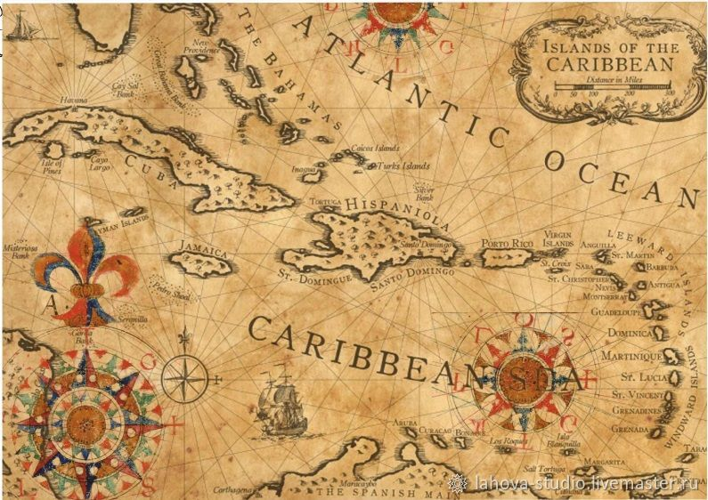

#### Полутоновое изображение:
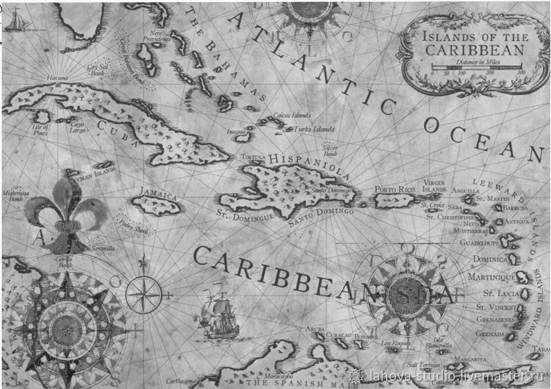

#### Бинаризация:
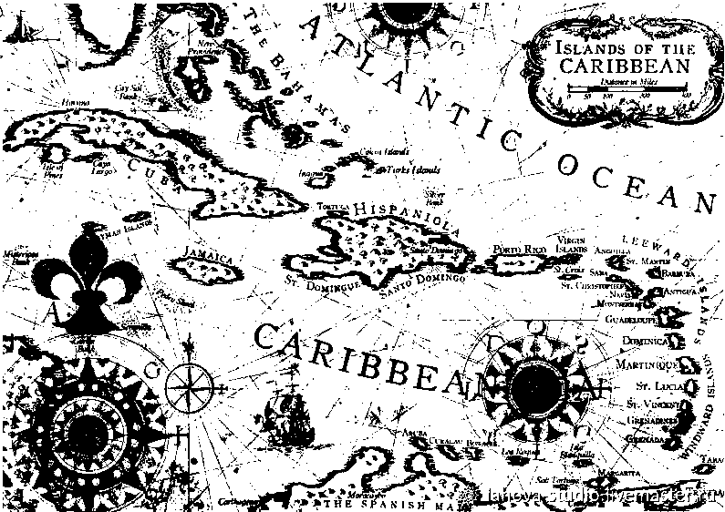

#### Адаптивная бинаризация Брэдли и Рота (окно 3x3):
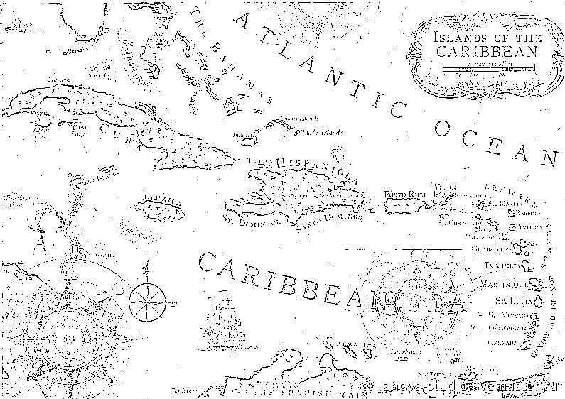

### Пример 2: Рентген

#### Исходное изображение:
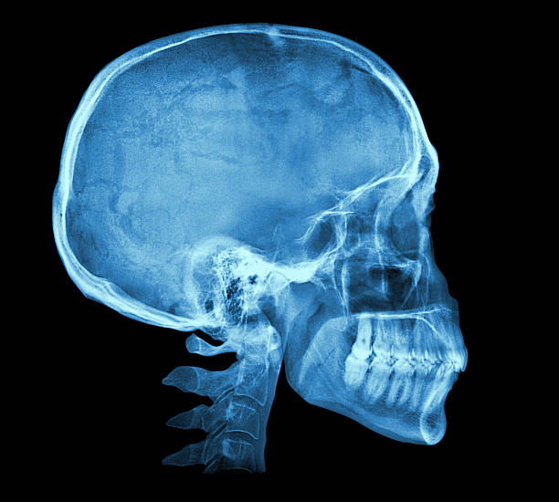

#### Полутоновое изображение:
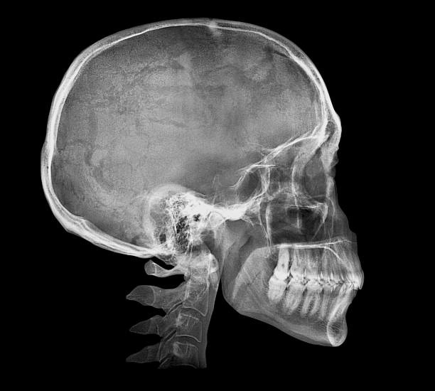

#### Бинаризация:
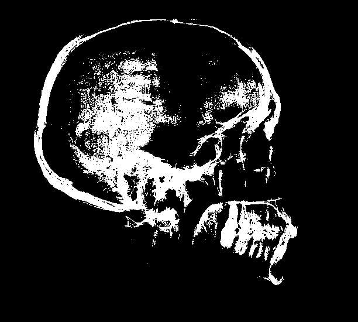

#### Адаптивная бинаризация Брэдли и Рота (окно 3x3):
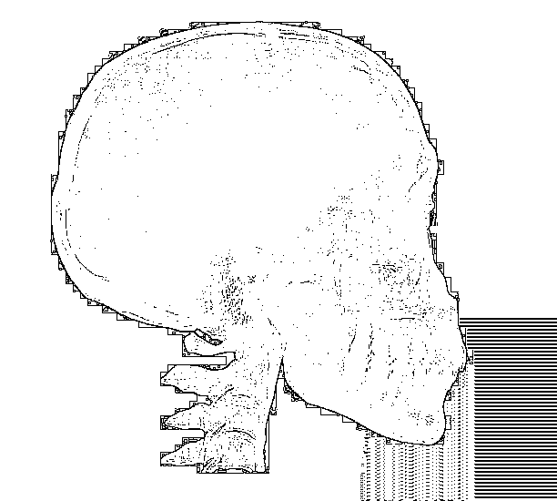

### Пример 3: Портрет

#### Исходное изображение:
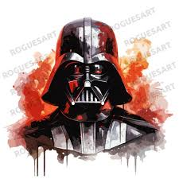

#### Полутоновое изображение:
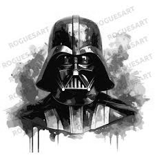

#### Бинаризация:
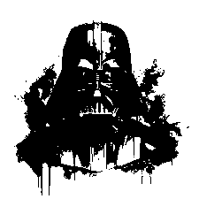

#### Адаптивная бинаризация Брэдли и Рота (окно 3x3):
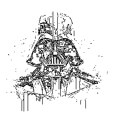

### Пример 4: Страница книги

#### Исходное изображение:
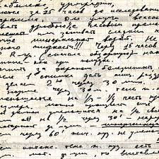

#### Полутоновое изображение:
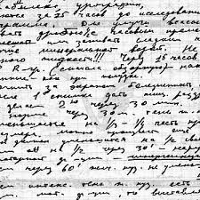

#### Бинаризация:
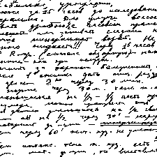

#### Адаптивная бинаризация Брэдли и Рота (окно 3x3):
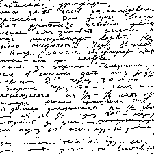

### Пример 5: Мультик

#### Исходное изображение:
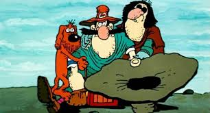

#### Полутоновое изображение:
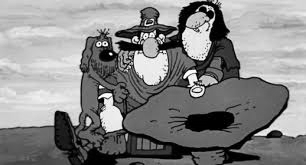

#### Бинаризация:
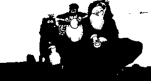

#### Адаптивная бинаризация Брэдли и Рота (окно 3x3):
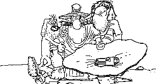

