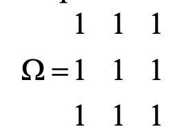
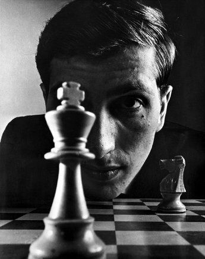
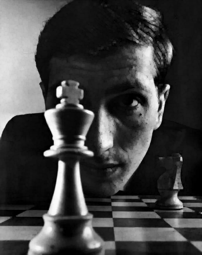
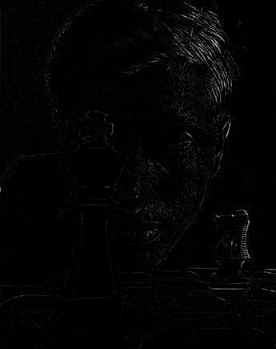
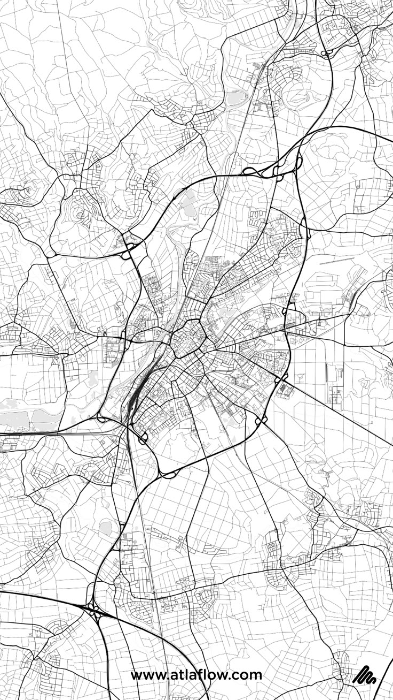
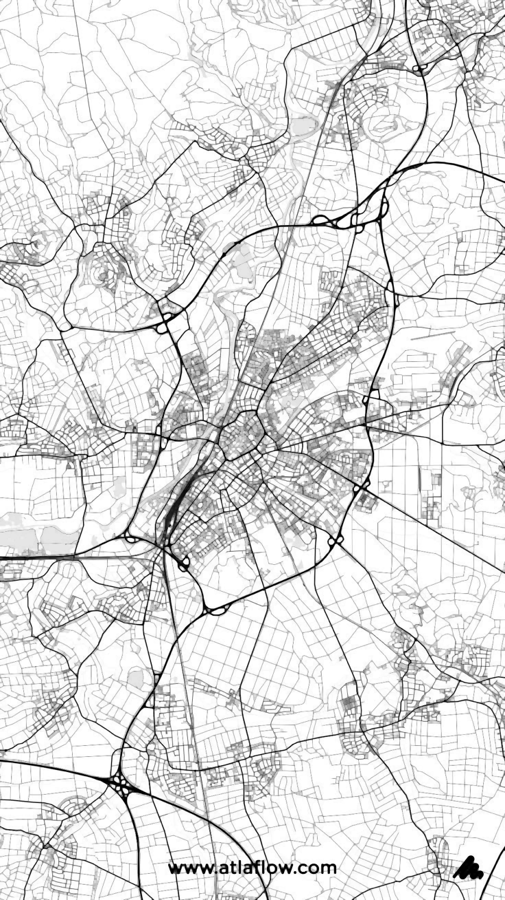
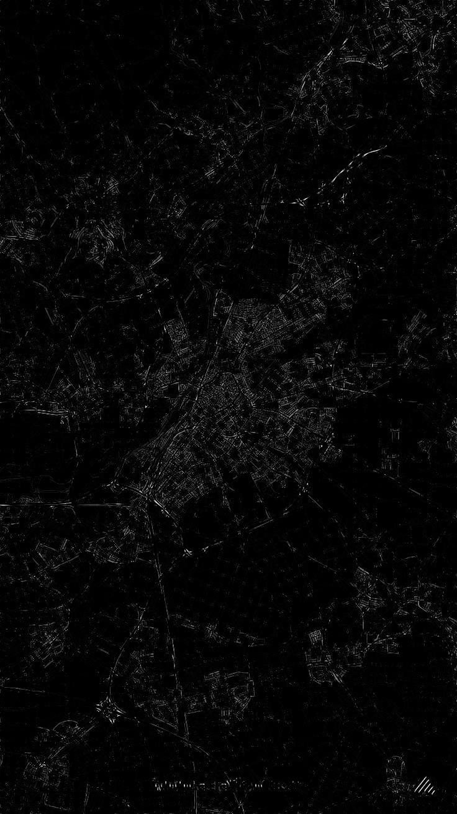
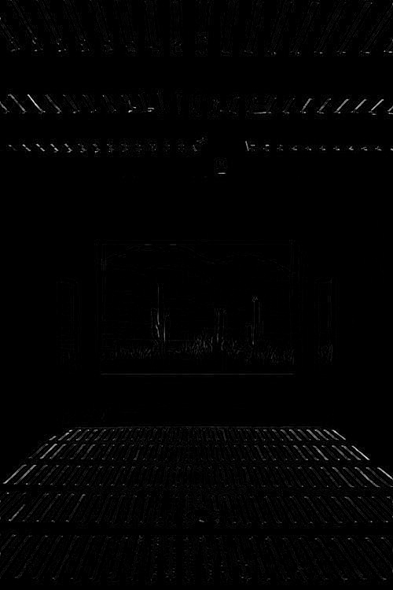

# Лабораторная работа №3
## Цветовые модели и передискретизация изображений 
морфологические операции
В качестве входных данных берётся монохромное (или полутоновое, где уместно)
изображение (несколько штук). В качестве выходных данных демонстрируется:
1) отфильтрованное монохромное (полутоновое) изображение;
2) разностное изображение (монохромный xor или модуль разности для полутона).
*Для методов фильтрации полутоновых изображений дополнительно можно
применить результаты к цветному изображению, из которого было получено начальное
полутоновое изображение.
## Вариант 4
Медианный фильтр. Маска — равнина

### Пример 1
#### Исходное изображение:

#### После применения фильтрации:

#### Разностное изображение:

### Пример 2

#### Исходное изображение:

#### После применения фильтрации:

#### Разностное изображение:

### Пример 3
#### Исходное изображение:

#### После применения фильтрации:

#### Разностное изображение:

