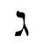
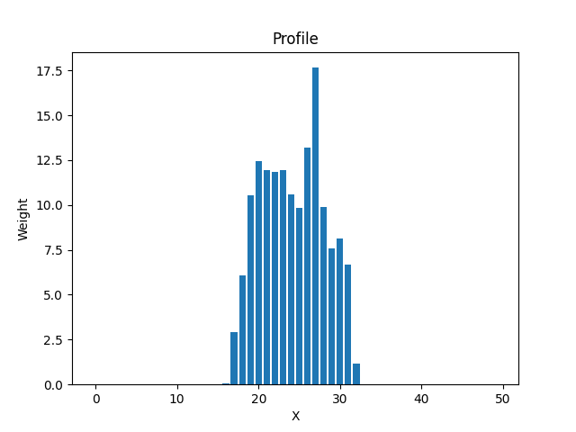
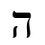
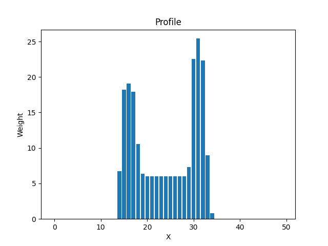
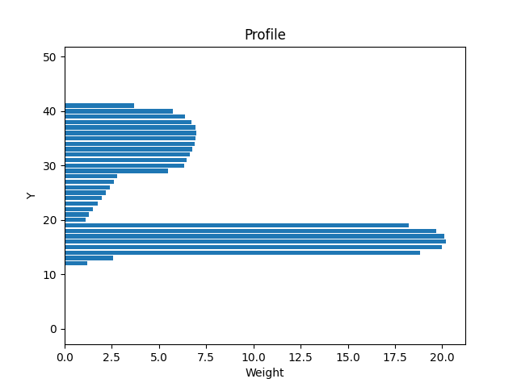
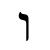
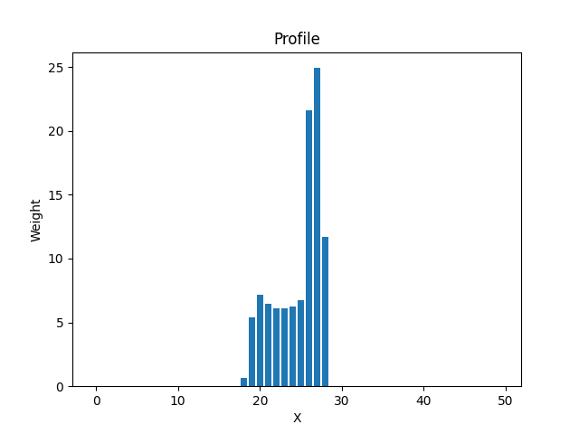
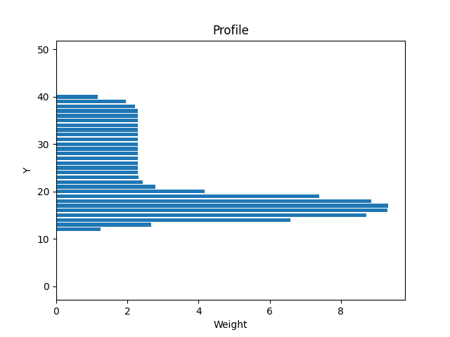

# Лабораторная работа №5
## Выделение признаков символов

#### Вариант 5: Иврит
#### ג ב ג ד ה ו ז ח ט י כ ך ל מ ם נ ן ס ע פ ף צ ץ ק ר ש ת ﭏ

### 5.1. Эталонные изображения сгенерированы в директории ./images шрифт Times New Roman, кегль 52 

### 5.2. Признаки по каждой букве:

### 5.3. Профили:
#### 1

#### 2

#### 3

