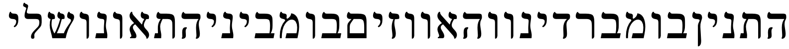
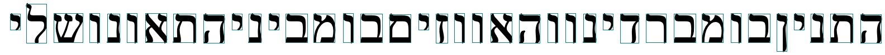
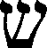

# Лабораторная работа №6
## Сегментация текста

#### Выбранный алфавит: Иврит
#### גדהוזחטיכךלמםנןסעפףצץקרשתﭏ

### Скриншот:

### Рeзультат сегментации символов:
#### Окаймляющие прямоугольники

#### Вырезанные символы

### Профили:

<h5>Сохранены в папке ./profiles</h5>

