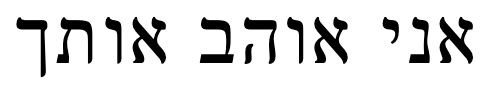
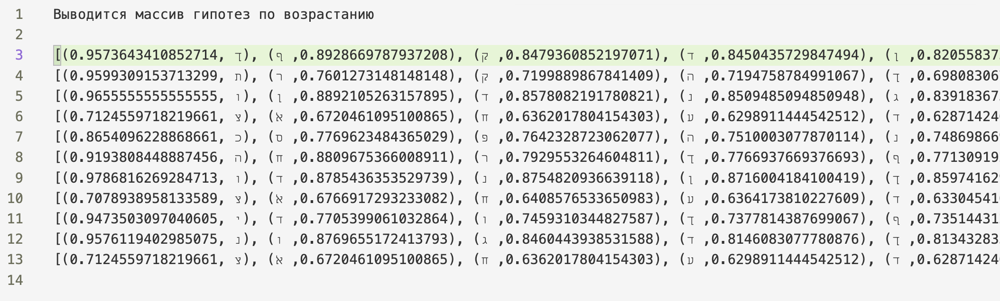
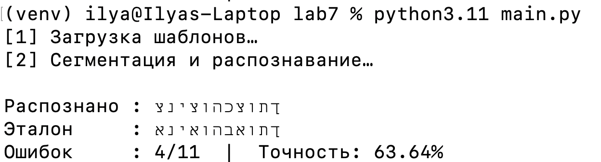
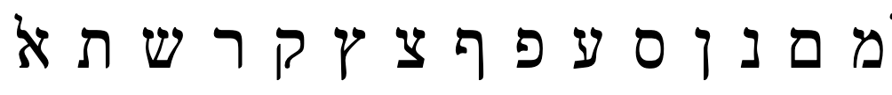
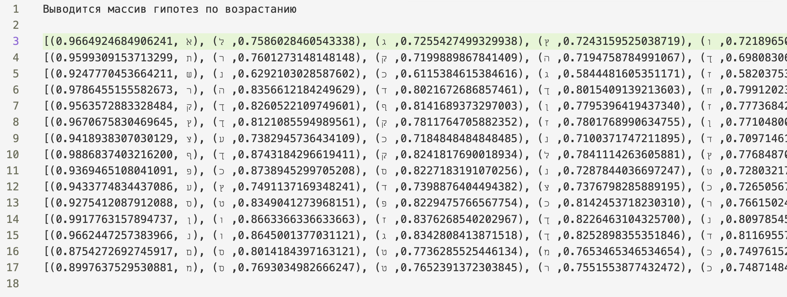
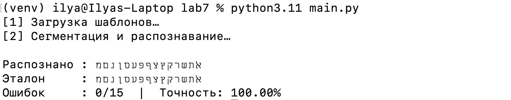
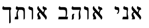
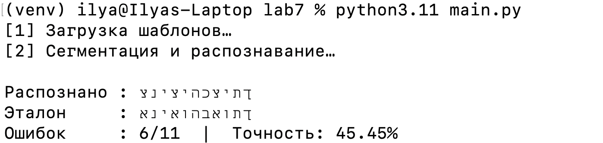
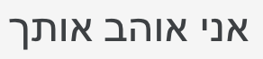
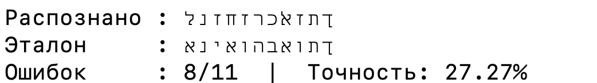

# Лабораторная работа №7
## Классификация на основе признаков, анализ профилей

#### Выбранный алфавит: Иврит
#### גדהוזחטיכךלמםנןסעפףצץקרשתﭏ

### Пример 1
#### Исходное изображение (26 pt):

#### Для каждого обнаруженного символа в строке рассчитать меру близости со всеми символами выбранного алфавита:

#### Рeзультат:

### Пример 2.

#### Исходное изображение:

#### После применения фильтрации:

#### Рeзультат:

### Пример 3.
#### Изображение с уменьшенным размером шрифта (15 pt):

#### Рeзультат:

### Пример 4.
#### Изображение c другим шрифтом (arial):

#### Рeзультат:
