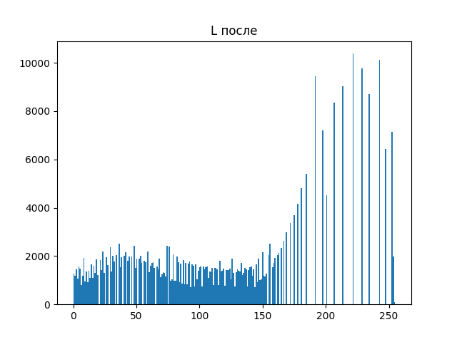

# Лабораторная работа №8
## Текстурный анализ и контрастирование

### Вариант 3
#### матрица NGLDM
#### d=1 
#### расчёт признаков CNG, CON. 
#### Метод преобразования яркости выравнивание гистограммы

### Исходные изображения

### Полутоновое изображения

### Контрастированное полутоновое изображение 

### Цветное изображение после выравнивания яркости (L)

### Гистограмма яркости до преобразования

### Гистограмма яркости после преобразования

### матрица NGLDM

### Признаки CNG и CON

