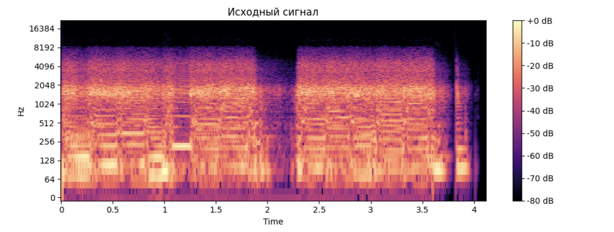
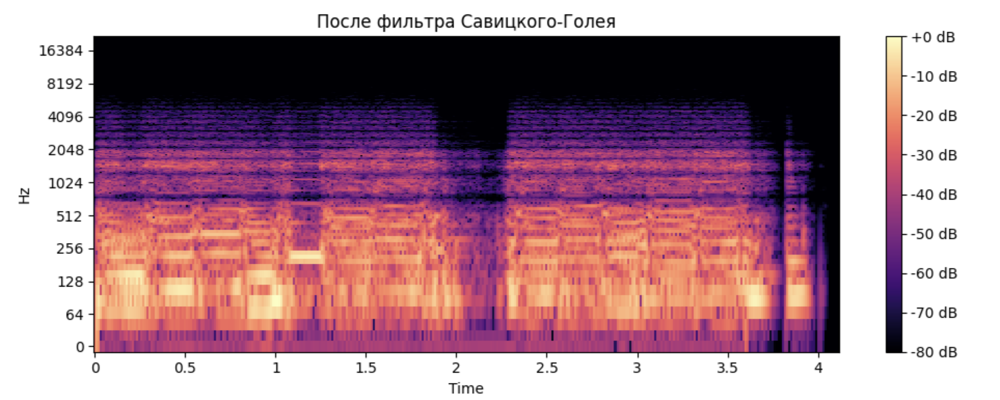
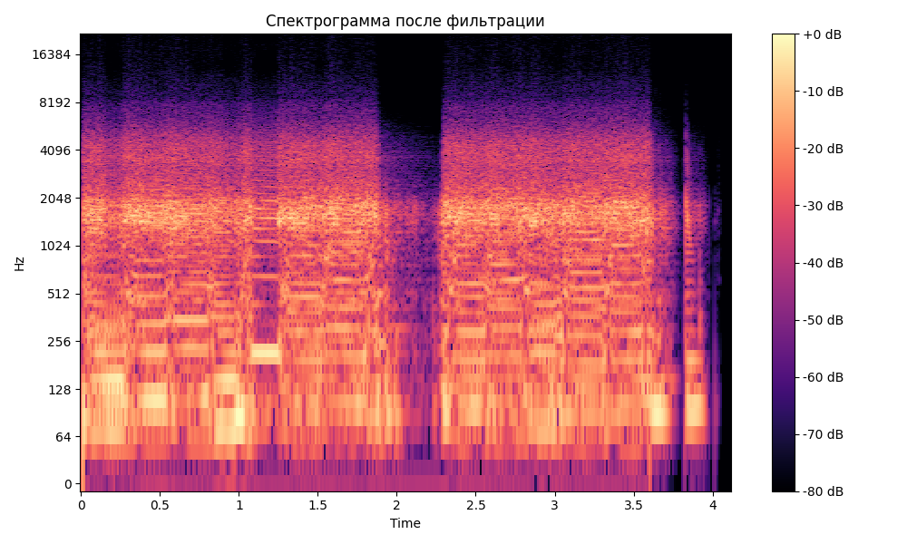
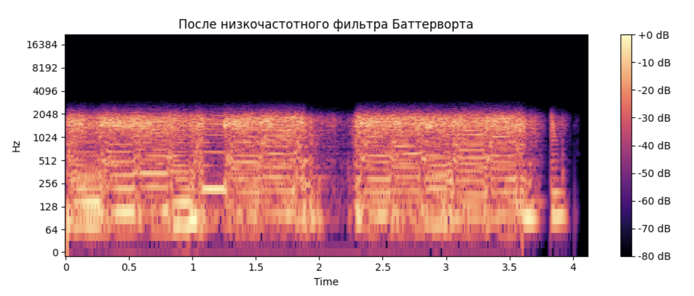

# Лабораторная работа №9  
## Анализ шума в аудиосигналах  
**ФИО:** *Гречко Илья Витальевич*  
**Группа:** *Б22-534*  

---

## Цель работы

Исследовать шум в аудиозаписи музыкального инструмента, визуализировать спектрограмму, применить методы фильтрации шума и определить моменты наибольшей энергетической активности.

---

### 1. Запись аудиосигнала

Было записано звук электрогитары в формате `.wav` длиной 4 секунды

### 2. Построение спектрограммы исходного сигнала

Была построена логарифмическая спектрограмма с использованием оконного преобразования Фурье (STFT) с окном Ханна.

---

### 3. Фильтрация шума

#### Фильтр Савицкого-Голея

Фильтр применялся для сглаживания сигнала, не изменяя его спектральный состав.

#### Фильтр Винера

#### Низкочастотный фильтр Баттерворта
Пропускает частоты ниже определённого порога:

#### Моменты с наибольшей энергией
Максимальная энергия около 0.95 сек.
Максимальная энергия около 2.10 сек.
Максимальная энергия около 3.60 сек.
